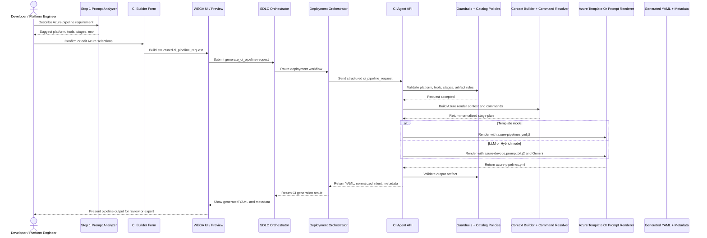

# WEGA Azure Pipeline Generation Architecture And Workflow

This document describes only the WEGA-side architecture for generating `azure-pipelines.yml`.

It does not describe Azure execution, Azure runtime targets, or downstream deployment topology. The focus is only:

1. how the user enters Azure pipeline requirements in WEGA
2. how WEGA turns those inputs into a structured `ci_pipeline_request`
3. how the CI Agent builds the Azure pipeline definition
4. where the Azure template and Azure prompt are used
5. what artifact is returned to the UI

Editable draw.io source: [WEGA_AZURE_PIPELINE_GENERATION.drawio](WEGA_AZURE_PIPELINE_GENERATION.drawio)

## WEGA Generation Architecture

```mermaid
flowchart LR
    Engineer[Developer / Platform Engineer]

    subgraph WEGAUI[WEGA UI]
        ANALYZER[Step 1 Prompt Analyzer]
        FORM[CI Builder Form]
        PREVIEW[Intent Preview And YAML Preview]
        INTENT[Structured ci_pipeline_request]
    end

    subgraph ORCH[WEGA Orchestration Layer]
        SDLC[SDLC Orchestrator]
        DEPLOY[Deployment Orchestrator]
    end

    subgraph CIAGENT[WEGA CI Agent]
        API[POST /v1/pipelines/generate]
        GUARD[Guardrails And Catalog Policies]
        CTX[Context Builder]
        CMD[Command Resolver]
        MODE{Render Mode}
        TEMPLATE[azure-pipelines.yml.j2]
        PROMPT[azure-devops.prompt.txt.j2]
        LLM[Gemini Renderer]
        OUTPUTCHECK[Artifact Validation]
    end

    subgraph OUTPUT[Returned Artifacts]
        YAML[Generated azure-pipelines.yml]
        META[Normalized Intent And Render Metadata]
    end

    Engineer --> ANALYZER
    ANALYZER -. Suggests values only .-> FORM
    Engineer --> FORM
    FORM --> INTENT --> PREVIEW
    PREVIEW --> SDLC --> DEPLOY --> API

    API --> GUARD --> CTX --> CMD --> MODE
    MODE -->|template| TEMPLATE --> OUTPUTCHECK
    MODE -->|llm or hybrid| PROMPT --> LLM --> OUTPUTCHECK
    OUTPUTCHECK --> YAML
    OUTPUTCHECK --> META
    YAML --> PREVIEW
    META --> PREVIEW
```

## What Each WEGA Layer Does

1. Step 1 Prompt Analyzer suggests likely Azure selections from the user prompt, but it does not currently auto-fill the form.
2. The CI Builder Form is the authoritative source of the final Azure pipeline intent.
3. The SDLC Orchestrator routes the UI request into the deployment domain.
4. The Deployment Orchestrator forwards the nested `ci_pipeline_request` to the CI Agent.
5. The CI Agent validates the request against catalogs and guardrails before rendering.
6. The Context Builder and Command Resolver produce Azure-ready stage definitions and commands.
7. Template mode uses `azure-pipelines.yml.j2`.
8. LLM mode uses `azure-devops.prompt.txt.j2` plus Gemini.
9. The output is always validated before the generated `azure-pipelines.yml` is returned.
10. The UI receives the YAML artifact plus normalized intent and render metadata for preview and follow-up actions.

## WEGA Generation Workflow

## Azure-Oriented Design Notes

1. `azure-pipelines.yml` is the primary output artifact WEGA produces for Azure DevOps.
2. The Azure-specific render assets are the template file `azure-pipelines.yml.j2` and the prompt file `azure-devops.prompt.txt.j2`.
3. The WEGA generation boundary ends when the CI Agent returns the YAML artifact and metadata.
4. Azure execution concerns are intentionally out of scope for this document.
5. This document should be used when discussing how WEGA builds the Azure pipeline, not how Azure later runs it.

## WEGA Mapping

1. Step 1 prompt analysis in the UI suggests likely selections for platform, language, tools, artifact type, and environment, but does not auto-apply them.
2. The CI builder form produces the structured `ci_pipeline_request` payload.
3. The Deployment Orchestrator forwards that payload to the CI Agent unchanged when available.
4. The CI Agent converts that payload into a normalized stage plan and then renders Azure DevOps YAML using template, LLM, or hybrid mode.
5. The generated pipeline is returned to the UI as an artifact for review, export, or commit.

## Suggested Next Extension

1. Add a second document for Azure execution topology only if deployment/runtime architecture is needed later.
2. Add real generated `azure-pipelines.yml` fragments beside the diagram once the Azure template and Azure prompt stabilize.
3. Add an `Apply prompt suggestions` UI flow if Step 1 should become a real prefill mechanism instead of suggestion-only analysis.